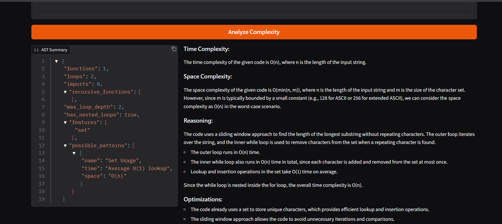
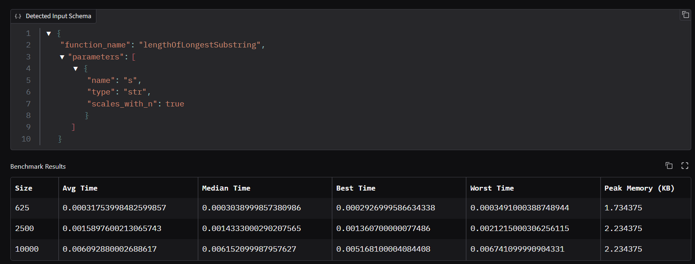
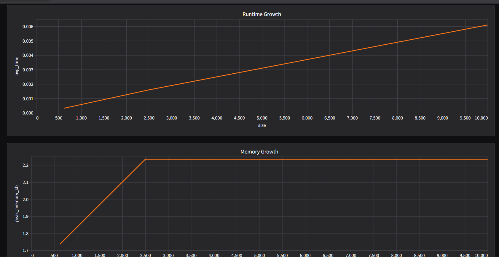
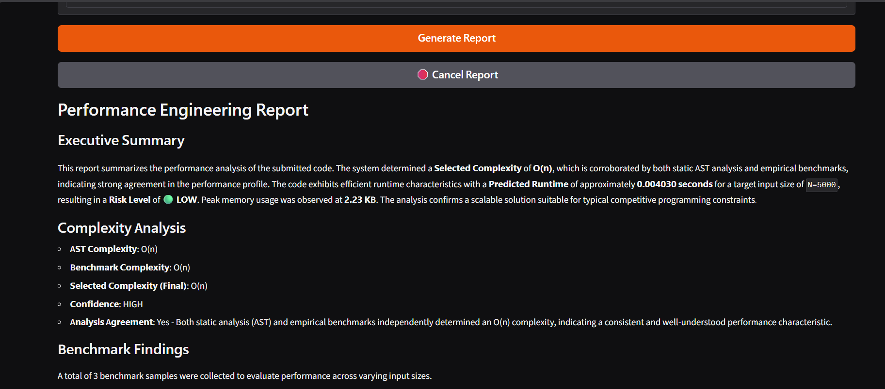

# AI Code Performance Studio

AI Code Performance Studio is a Python-based analysis platform that combines static code analysis, empirical benchmarking, and AI-generated performance reporting to evaluate the scalability of Python programs.

Instead of relying solely on theoretical complexity estimates or runtime measurements, the system combines both approaches to provide a more reliable assessment of algorithmic performance, memory usage, and Time Limit Exceeded (TLE) risk.

---

## Features

### Static Complexity Analysis
- Parses source code using Python's Abstract Syntax Tree (AST).
- Detects:
  - Loop nesting depth
  - Recursion
  - Sorting operations
  - Hash-based structures
  - Heap operations
  - Queue operations
  - Slicing and copying patterns
- Generates structural complexity assessments using an LLM-assisted analysis pipeline.

### Empirical Benchmarking
- Executes code against progressively larger inputs.
- Measures:
  - Average runtime
  - Median runtime
  - Best runtime
  - Worst runtime
  - Peak memory usage

### Complexity Reconciliation
- Compares:
  - AST-derived complexity
  - Benchmark-observed complexity
- Uses a conservative selection strategy when results disagree.

### TLE Risk Prediction
- Projects runtime growth to target constraints.
- Supports multiple complexity classes:
  - O(1)
  - O(log n)
  - O(√n)
  - O(n)
  - O(n log n)
  - O(n√n)
  - O(n²)
  - O(n² log n)
  - O(n³)
  - O(2ⁿ)

### AI Performance Reports
- Generates detailed engineering reports using Gemini.
- Includes:
  - Complexity analysis
  - Scalability assessment
  - Memory analysis
  - TLE risk evaluation
  - Optimization recommendations

### Interactive Gradio Interface
Provides a multi-tab dashboard for:
- Complexity Analysis
- Benchmarking
- TLE Prediction
- AI Report Generation

---

## System Architecture

```text
User Code
    │
    ▼
┌─────────────────────┐
│   Gradio Interface  │
└──────────┬──────────┘
           │
   ┌───────┴────────┐
   ▼                ▼
┌───────────┐  ┌──────────────┐
│ AST       │  │ Benchmark    │
│ Analyzer  │  │ Engine       │
└─────┬─────┘  └──────┬───────┘
      │               │
      └───────┬───────┘
              ▼
 ┌─────────────────────┐
 │ Complexity          │
 │ Reconciliation      │
 └──────────┬──────────┘
            ▼
 ┌─────────────────────┐
 │ TLE Predictor       │
 └──────────┬──────────┘
            ▼
 ┌─────────────────────┐
 │ AI Report Generator │
 └─────────────────────┘
```

---

## Analysis Pipeline

1. User submits Python code.
2. AST Analyzer extracts structural features.
3. Benchmark Engine measures runtime and memory usage.
4. Complexity estimates are compared.
5. The system selects the safer complexity model.
6. Runtime projections are calculated for target constraints.
7. Gemini generates a detailed engineering report.

---
## Demo

### Complexity Analysis



The AST analysis engine extracts structural features such as recursion patterns, loop nesting depth, collection usage, and algorithmic indicators before generating a complexity assessment.

---

### Benchmark Dashboard


#### bench_mark_report




#### Time and Memory Usage



Tracks time and  peak memory consumption during benchmark execution to identify memory-growth patterns and potential bottlenecks.

---

### AI Performance Report



Generates a comprehensive engineering report using benchmark measurements, complexity estimates, runtime projections, and memory statistics produced by the analysis engine.

---


## Project Structure

```text
AI-Code-Performance-Studio/
│
├── main.py
├── ast_file.py
├── tle_controller.py
├── TLE_.py
├── final_report.py
│
├── Benchmark/
│   └── Benchmark_controller.py
│
├── patterns.json
├── .env
├── requirements.txt
└── README.md
```

---


## Installation

### Prerequisites

- Python 3.10+
- Groq API Key
- Gemini API Key

---

### Clone Repository

```bash
git clone https://github.com/<your-username>/AI-Code-Performance-Studio.git

cd AI-Code-Performance-Studio
```

---

### Create Virtual Environment

#### Linux / macOS

```bash
python3 -m venv venv
source venv/bin/activate
```

#### Windows

```bash
python -m venv venv
venv\Scripts\activate
```

---

### Install Dependencies

```bash
pip install -r requirements.txt
```

If a requirements file is not available:

```bash
pip install gradio pandas python-dotenv openai groq
```

---

## Configuration

Create a `.env` file in the project root:

```env
groq_api=YOUR_GROQ_API_KEY
google_key=YOUR_GEMINI_API_KEY
```

---

## Running the Application

```bash
python main.py
```

Gradio will launch a local web application and generate a shareable public URL.

---

## Computation First, AI Second

A common misconception is that this project relies entirely on a large language model to determine complexity and performance characteristics. In reality, the majority of the analysis pipeline is implemented through deterministic Python systems.

The project follows a **"Computation First, AI Second"** architecture.

---

### What Is Computed Programmatically?

The following components are implemented using Python and generate the core analytical results:

- AST parsing and feature extraction
- Loop and recursion detection
- Structural pattern identification
- Runtime benchmarking
- Memory profiling
- Complexity reconciliation
- Runtime projection
- TLE risk estimation

These systems produce the numerical metrics and performance predictions that drive the platform.

---

### How AI Is Used

Large language models are used as an interpretation layer rather than the primary source of truth.

For complexity analysis, the AST subsystem first extracts structural metadata from the source code, including recursion patterns, loop depth, collection usage, sorting operations, heap operations, and other complexity-related signals. The model receives this information as supporting context to assist in generating structured explanations.

For report generation, benchmark results, runtime projections, memory statistics, and complexity estimates are first computed by the Python analysis engine. The language model is then provided with these computed metrics and instructed to explain, summarize, and interpret them without generating new measurements.

---

### Why This Design Was Chosen

Relying exclusively on an LLM for performance analysis can lead to inconsistent results and hallucinated metrics. To reduce this risk, the project separates computation from explanation.

All critical decisions—including benchmark measurements, complexity reconciliation, runtime scaling, and TLE risk prediction—originate from deterministic Python components. The language model is used only to improve readability, provide engineering insights, and generate optimization recommendations.

This design allows the system to benefit from AI-assisted explanations while ensuring that the underlying analytical results are grounded in measurable program behavior.


---


## Technical Challenges Encountered

Building a generic performance-analysis platform introduced several practical engineering challenges beyond traditional code analysis.

---

### 1. Benchmarking Arbitrary User Code

One of the most difficult challenges was benchmarking arbitrary Python code safely and consistently.

Unlike predefined algorithms, users can submit any implementation, including inefficient nested loops, recursive solutions, or memory-intensive programs. Some benchmark runs can become extremely slow even for relatively small input sizes.

For example, cubic-time algorithms (O(n³)) can already become impractical at relatively small input sizes, making it difficult to collect benchmark data while keeping the application responsive.

Balancing benchmark accuracy with usability required restricting benchmark ranges and carefully selecting sample sizes.

---

### 2. Supporting Competitive Programming Data Structures

The current benchmarking system primarily supports primitive data types and primitive collections.

Supporting common interview and competitive-programming structures such as:

- Linked Lists
- Binary Trees
- Graph Nodes
- Custom Classes

proved significantly more difficult because benchmark generation requires automatic creation of valid object graphs and input schemas.

Designing a generalized benchmark generator for these structures remains one of the largest unfinished components of the project.

---

### 3. Complexity Disagreements Between Static and Dynamic Analysis

Static analysis and empirical benchmarking frequently produce different complexity estimates.

For example, a program may structurally appear quadratic due to nested loops while benchmark results suggest near-linear behavior because benchmark inputs do not trigger worst-case execution paths.

Determining which result should be trusted was a major challenge.

The final implementation uses a conservative reconciliation strategy that selects the higher-impact complexity estimate when disagreements occur, prioritizing worst-case safety over optimistic projections.

---

### 4. Reducing Dependence on LLM Reasoning

A major design goal was ensuring that the project did not become a simple wrapper around a language model.

Early prototypes relied more heavily on model-generated analysis, which introduced inconsistencies and occasional misclassification of algorithmic complexity.

To improve reliability, most analytical responsibilities were moved into deterministic Python systems, including:

- AST feature extraction
- Runtime benchmarking
- Memory profiling
- Complexity reconciliation
- Runtime projection
- TLE risk estimation

Large language models are now primarily used for explanation and report generation rather than core performance computation.

---

### 5. Runtime Projection Accuracy

Predicting execution time for input sizes that have never been directly benchmarked is inherently difficult.

The system uses complexity-based scaling models to extrapolate runtime growth from measured samples to target constraints.

While this approach provides useful risk estimates, real-world performance can still be affected by interpreter overhead, memory allocation behavior, hardware differences, and implementation-specific optimizations.

As a result, runtime projections should be interpreted as engineering estimates rather than exact execution guarantees.

---

### 6. Long-Running Analysis Workflows

Performance analysis is composed of multiple computationally expensive stages:

1. AST analysis
2. Benchmark execution
3. Complexity reconciliation
4. Runtime projection
5. AI report generation

Without additional handling, these operations can make the user interface appear frozen.

To address this, the application implements streamed status updates, asynchronous workflows, and cancellation mechanisms that allow users to terminate long-running analyses without restarting the application.

---

### 7. Resource Consumption and Execution Safety

Benchmarks currently execute within the host Python process.

This introduces practical limitations because poorly optimized code, deep recursion, excessive memory allocation, or extremely expensive algorithms can consume significant system resources.

Future versions aim to move benchmark execution into isolated subprocesses or containerized environments to improve safety and stability.

---

### 8. Building a Generic Benchmarking Framework

Creating a benchmarking framework that works across many coding styles was significantly more difficult than benchmarking a single algorithm.

The system must automatically:

- Detect callable functions
- Infer input schemas
- Generate test inputs
- Execute benchmarks
- Collect runtime statistics
- Track memory usage
- Estimate complexity trends

while requiring minimal user configuration.

Designing this generalized workflow became one of the most technically challenging aspects of the project.

---


## Why Not Just Use an LLM?

Most AI code-review tools rely entirely on model reasoning.

AI Code Performance Studio combines:

- AST feature extraction
- Runtime benchmarking
- Memory profiling
- Complexity reconciliation
- Mathematical runtime projection

before invoking any language model.

This reduces dependence on model guesses and grounds reports in measurable program behavior.

---

## Benchmark Assumptions

Runtime projections assume that:

- The measured complexity trend remains stable.
- Benchmark inputs are representative.
- Hardware characteristics remain comparable.

Predictions are intended as risk estimates rather than guaranteed execution times.

---


## External Dependencies

The project currently requires:

- Groq API (AST complexity analysis)
- Gemini API (performance report generation)

Without these services, some functionality will be unavailable.

---

## Example

### Input Code

```python
def find_duplicates(nums):
    duplicates = []

    for i in range(len(nums)):
        for j in range(i + 1, len(nums)):
            if nums[i] == nums[j] and nums[i] not in duplicates:
                duplicates.append(nums[i])

    return duplicates
```

### Constraint

```text
n <= 50000
```

### Example Output

```text
AST Complexity: O(n²)

Benchmark Complexity: O(n²)

Selected Complexity: O(n²)

Predicted Runtime: 4.21 sec

Risk Level: VERY HIGH
```

---

## Supported Complexity Classes

| Complexity |
|------------|
| O(1) |
| O(log n) |
| O(√n) |
| O(n) |
| O(n log n) |
| O(n√n) |
| O(n²) |
| O(n² log n) |
| O(n³) |
| O(2ⁿ) |

---

## Limitations

### Benchmarking Constraints

Currently supported input types:

- int
- float
- str
- list[int]
- list[float]
- list[str]

Not currently supported:

- Linked Lists
- Trees
- Graph Nodes
- Custom Objects

### Runtime Environment

Benchmarks execute in the host Python process.

Extremely expensive code may:
- Consume large amounts of memory
- Increase execution times
- Impact local machine responsiveness

### Complexity Estimation

AST-based complexity analysis uses structural signals combined with LLM-assisted reasoning. Results should be treated as informed estimates rather than formal proofs.

---
## Current Status

Active Development

Implemented:
- AST analysis
- Benchmarking
- TLE prediction
- AI reports

In Progress:
- Linked List support
- TreeNode support
- Graph object generation
- Benchmark sandboxing

---

## Future Improvements

### Sandbox Isolation

Move benchmark execution into isolated subprocesses or containers for safer execution.

### Additional Data Structures

Support automatic generators for:

- Linked Lists
- Binary Trees
- Graphs
- Custom Classes

### Offline Mode

Add support for local models through:

- Ollama
- Llama 3
- Mistral

to remove dependence on external APIs.

### Enhanced Benchmarking

- CPU profiling
- Memory growth visualization
- Multi-function benchmarking
- Statistical confidence scoring

---

## Disclaimer

Complexity estimates are generated using a combination of AST analysis, pattern detection, benchmarking, and LLM-assisted interpretation.

Results should be considered engineering estimates rather than formal mathematical proofs.

---

## Design Goals

- Combine static and dynamic performance analysis.
- Provide conservative complexity estimation.
- Deliver explainable runtime projections.
- Generate actionable optimization guidance.
- Offer an accessible developer workflow through a web interface.

---
